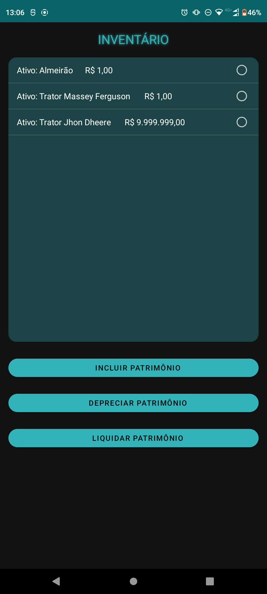
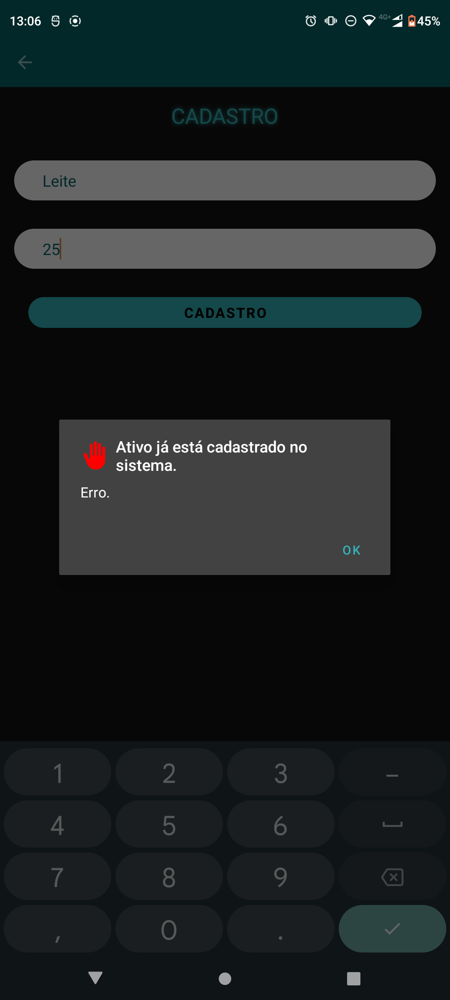

# Controle-De-Patrimonio-Java

##Trabalho Final Aplicativos Mobile Etec
##Aluno: Matheus Augusto Santos Martinelli
 - Data de inicio: 26 de Novembro de 2022
 - Data de finalização: 29 de Novembro de 2022

#Aplicação controle de patrimônio

Disponivem em <https://github.com/MartinelliNTZ/Controle-De-Patrimonio-Java>

#Descrição
É um aplicativo móvel simples que gerencia o inventário, tem o propósito de listar os itens do património exibindo sua breve descrição e seu respectivo valor. Também contém no App a função de DEPRECIAR e LIQUIDAR itens, com observância a algumas regras: 1º) para liquidar um item, seu valor deve ser igual o menor que R$ 0,00; 2º) a depreciação não pode ter um valor menor do que 10% do seu valor atual, ou seja, se um item tiver um valor de R$ 500,00, sua depreciação não pode ser menor que R$ 50,00, o que remete ao novo valor de R$ 450,00. Ao depreciar o item novamente, aplica-se a mesma regra de 10% do novo valor do item e assim por adiante.
Projeto foi desenvolvido no Android Studio com linguagem Java e banco de dados SQLite.
Foi usado neste projeto o padrão Model View Presenter  onde a view é responsável por exibir dados e receber ordem do usuário, a camada Model faz a conexão com o banco de dados e a camada presenter faz a ligação entre view e model impedindo que elas se comuniquem diretamente.
Todas as classes do sistema MVP implementam um interface com os métodos, toda documentação e explicação dos métodos está contida na interface.

# Home Page
 -   

# Cadastro
 -   

# Video de apresentação

